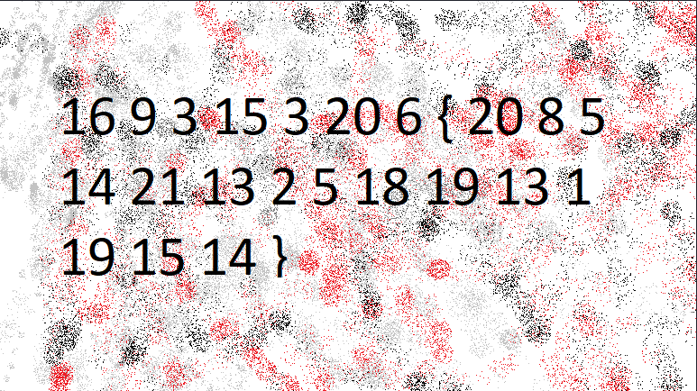
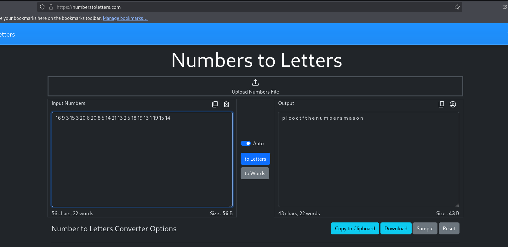
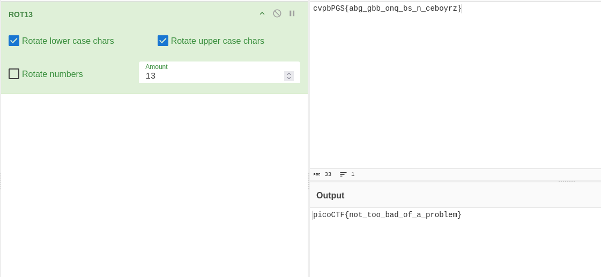
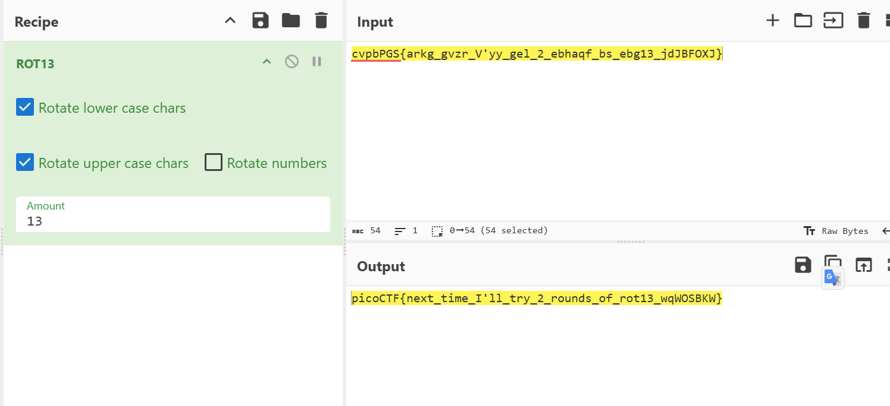
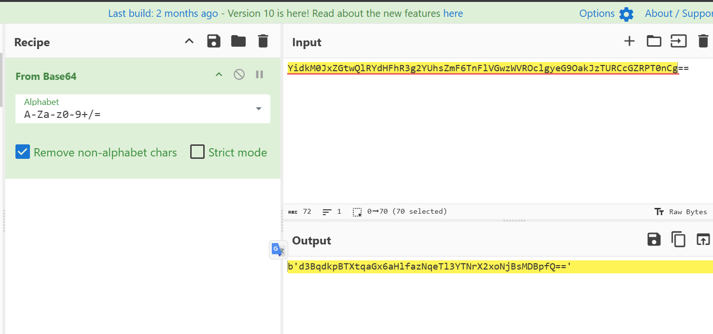
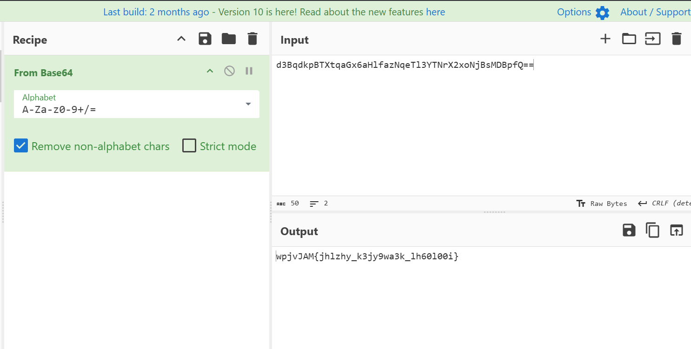
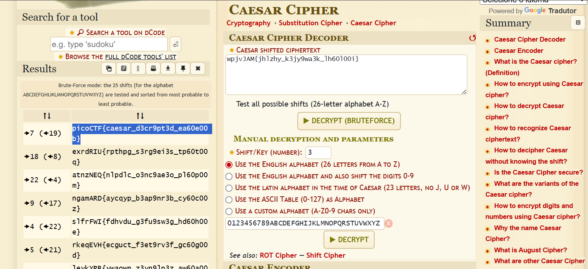
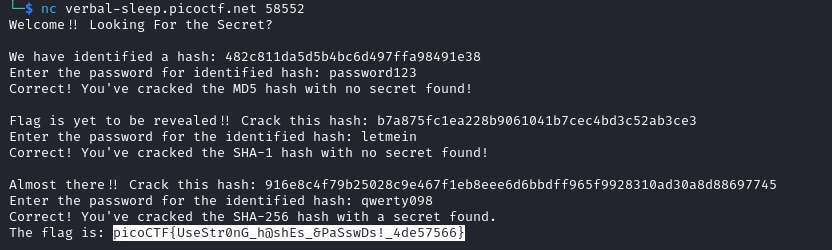

# The Numbers
*“The numbers... what do they mean?”*

 

This challenge provided the following image:

 

At first glance, it might look like a substitution cipher. However, if we look closely, the third number is 3. In alphanumeric code, the number 3 corresponds to the letter 'c'. This gives us a hint that it is a substitution cipher.

We can simply input the numbers into an online decoder.

 

And then, we get our flag:
picoCTF{thenumbersmason}

 

# 13
*“Cryptography can be easy, do you know what ROT13 is? `cvpbPGS{abg_gbb_onq_bs_n_ceboyrz}`”*

 

All the information we need is right here. We just need to decode the given string using ROT13.

 

# Mod 26
*“Cryptography can be easy, do you know what ROT13 is? `cvpbPGS{arkg_gvzr_V'yy_gel_2_ebhaqf_bs_ebg13_jdJBFOXJ}`”*

 

Again, we only need to apply ROT13 to decode the flag.

 

# interencdec
*“Can you get the real meaning from this file? Download the file here.”*

 

The downloaded file contains a Base64-encoded string. I decided to use [CyberChef](https://gchq.github.io/CyberChef/) to decode

 

Decoding this string gives us another Base64 string.

 

After the second Base64 decoding, we get what appears to be an encrypted flag. At first, CyberChef doesn’t automatically detect the cipher, but it looks like a substitution cipher. I decided to try a Caesar cipher decoder on [dcode.fr](https://www.dcode.fr/caesar-cipher), and found the flag:

 

# hashcrack
*“A company stored a secret message on a server which got breached due to the admin using weakly hashed passwords. Can you gain access to the secret stored within the server?”*

 

When we access the machine, we are given three sequential hashes. Each hash can be looked up directly using a search engine. Alternatively, you can use command-line, tools or websites like https://md5hashing.net/hash/sha256/ to crack them.

 
