# Glory of the Garden
*“This garden contains more than it seems.”*

 

For this challenge, I started with the provided image. With no immediate clues, I used `exiftool` and `file`, but found nothing unusual—it appeared to be a normal picture.

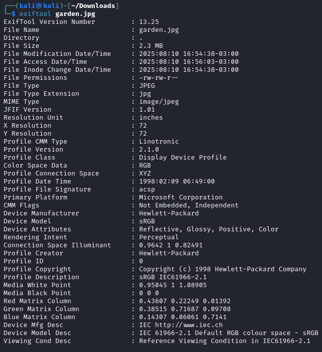

 

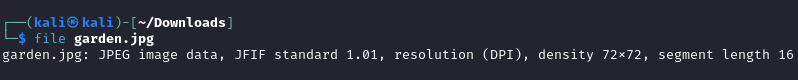

 

I then checked the challenge hint:

 

This pointed me in the right direction. Using Bless Hex Editor, I examined the raw binary data of the image. I searched for the flag and found it directly in the hex data.

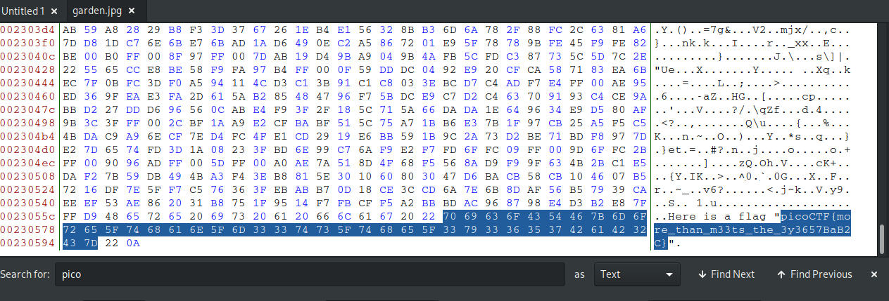

 

# Information
“Files can always be changed in a secret way. Can you find the flag? cat.jpg”

 

Opening the image revealed only a cute kitten.

 

The `file` command confirmed it was a JPEG. Checking the metadata, I noticed a suspicious Base64 string in the Rights field.

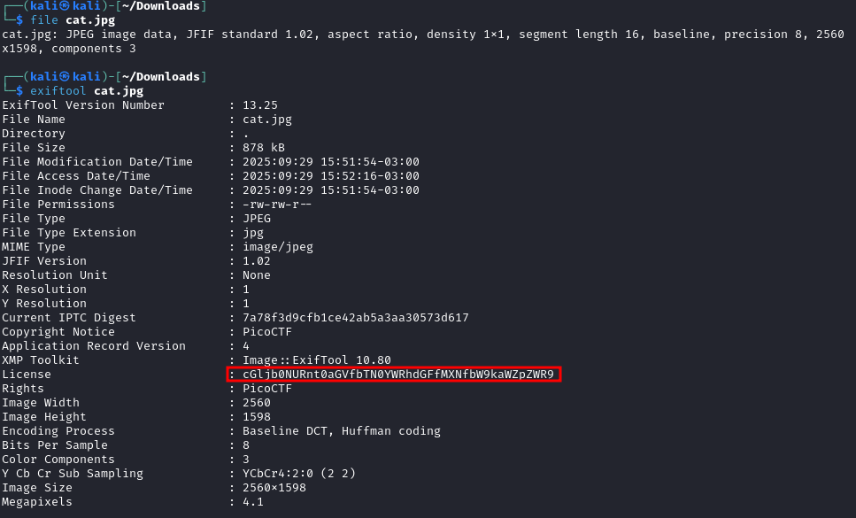

 

Decoding this string in [CyberChef](https://gchq.github.io/CyberChef/) revealed the flag.

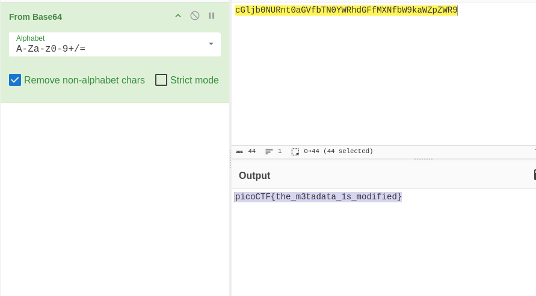

 

# CanYouSee
*“How about some hide and seek? Download this file here.”*

I inspected the image metadata and found a Base64 string.

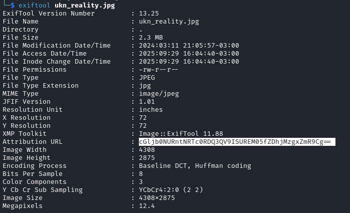

 

Decoding it gave the flag.

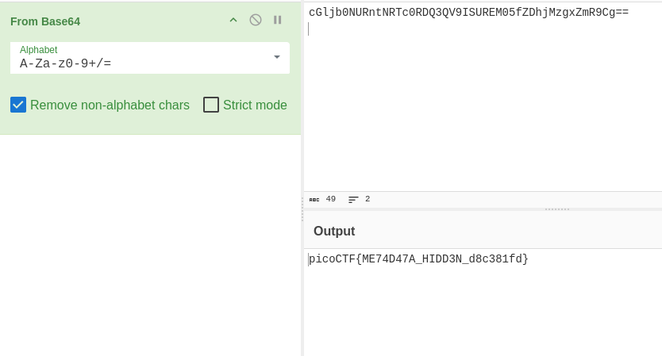

 

# Secret of the Polyglot
*“The Network Operations Center (NOC) of your local institution picked up a suspicious file, they're getting conflicting information on what type of file it is. They've brought you in as an external expert to examine the file. Can you extract all the information from this strange file?”*

 

Opening the PDF revealed the second part of the flag.

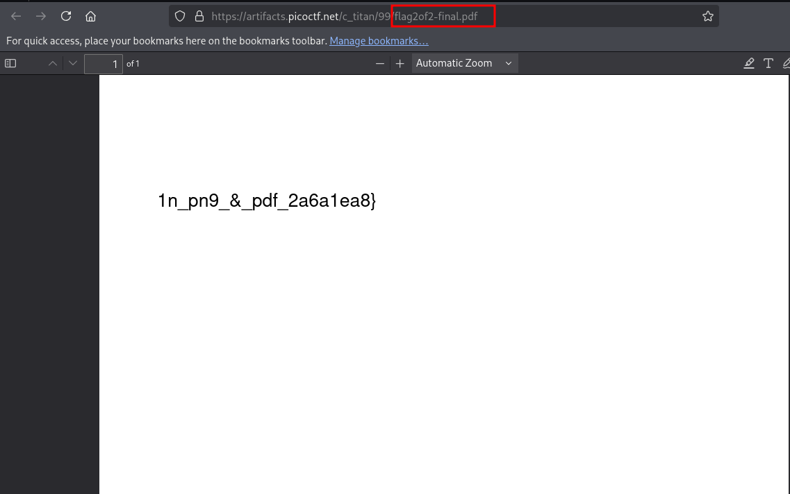

 

Since a polyglot file can have multiple formats, I changed the extension to PNG and found the first half of the flag.

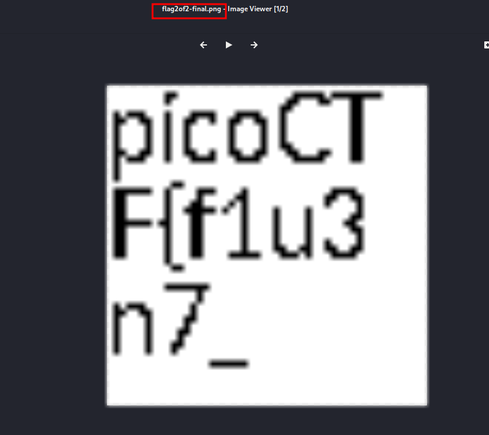

 

# Scan Surprise
*“I've gotten bored of handing out flags as text. Wouldn't it be cool if they were an image instead?“*

 

The challenge provided a ZIP file containing multiple nested folders. In the deepest folder, I found a QR code. Scanning it revealed the flag.

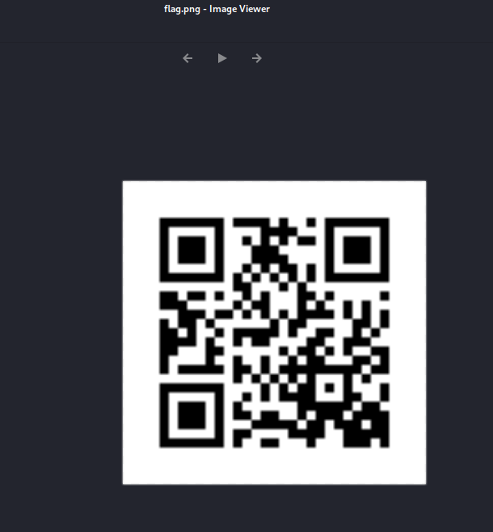

 

# Verify
*“People keep trying to trick my players with imitation flags. I want to make sure they get the real thing! I'm going to provide the SHA-256 hash and a decrypt script to help you know that my flags are legitimate.”*

 

Connecting to the challenge provided a checksum and a decrypt program.

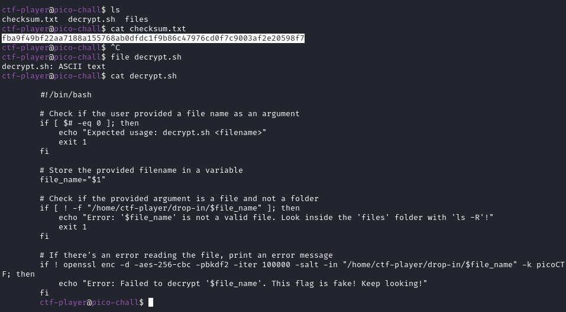

 

Running the program with the checksum initially failed:

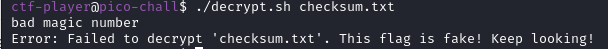

 

Looking inside the `files` folder, there are many files without obvious clues. However, when we check the fingerprints using `sha256sum`, one file has the exact same hash as the one in the text file.

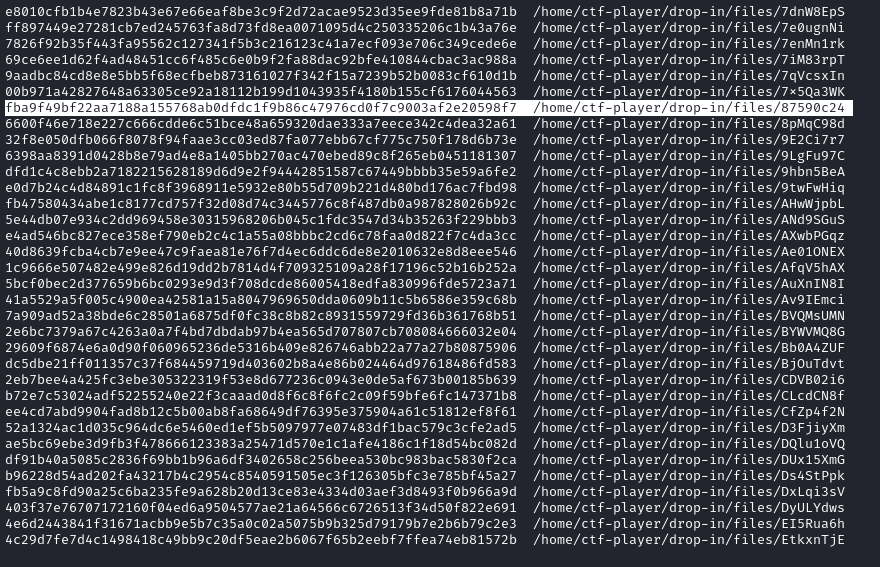

 

Using the decrypt program with this file revealed the flag.

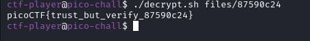

 

# Ph4nt0m 1ntrud3r
*“A digital ghost has breached my defenses, and my sensitive data has been stolen! 😱💻 Your mission is to uncover how this phantom intruder infiltrated my system and retrieve the hidden flag. To solve this challenge, you'll need to analyze the provided PCAP file and track down the attack method. The attacker has cleverly concealed his moves in well timely manner. Dive into the network traffic, apply the right filters and show off your forensic prowess and unmask the digital intruder! “*

 

Opening the PCAP in Wireshark revealed 22 TCP streams. In the hex dump, I noticed suspicious Base64 strings appearing across multiple packets.

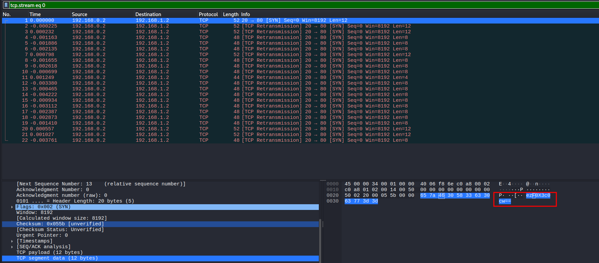

 

First, we use tshark with -T fields and -e tcp.payload to locate where the Base64 strings are stored:
`tshark -r myNetworkTraffic.pcap -T fields -e tcp.payload`

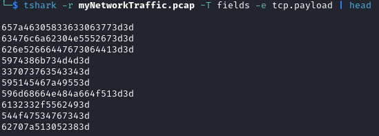

 

With positive results from the previous command, we use: `tshark -r myNetworkTraffic.pcap -T fields -e tcp.payload | xxd -r -p | grep -o '[A-Za-z0-9+/=]\{4,\}' > base64_parts.txt` to extract all Base64 strings into a text file.

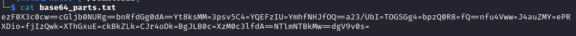

 

Not all strings decoded properly, but valid flag fragments were present.

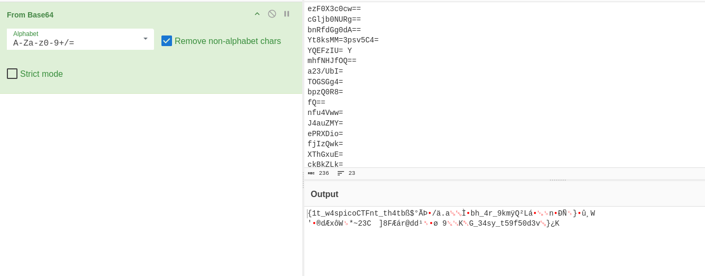

 

Filtering for strings ending with "==" and arranging them in order revealed the complete flag.

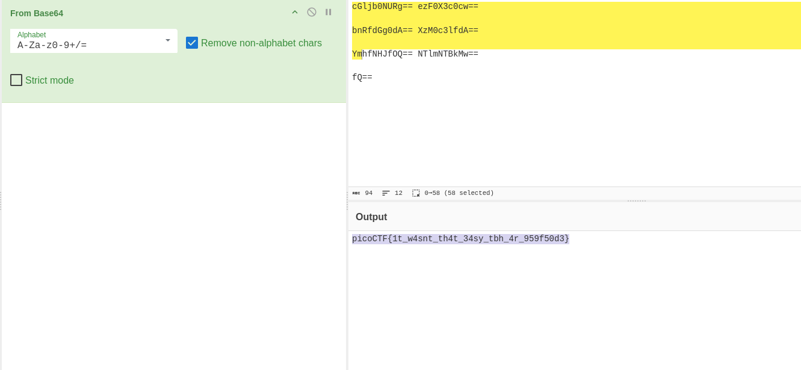

 

# RED
*“RED, RED, RED, RED Download the image: red.png”*

 

The red square image had nothing unusual in its metadata, but contained a poem, suggesting steganography.

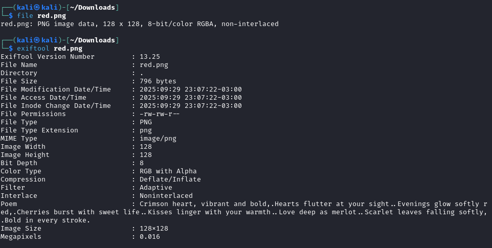

 

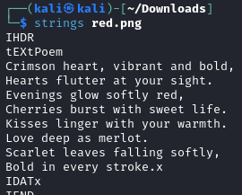

 

Using `zsteg` revealed a Base64 string in the initial analysis.

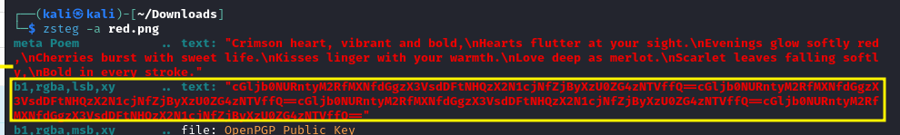

 

Decoding it provided the flag.

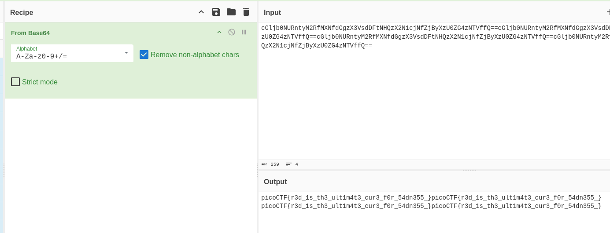

 

# DISKO 1
*“Can you find the flag in this disk image?”*

First, I used file to identify the image type. Running `strings` produced extensive output which I interpreted as a hint.

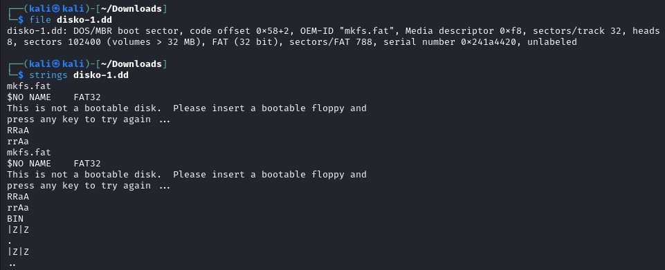

 

Filtering for "pico" using `grep` directly revealed the flag.

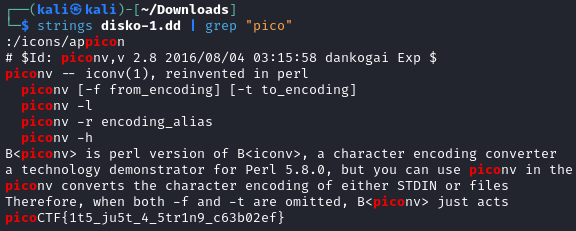

 

